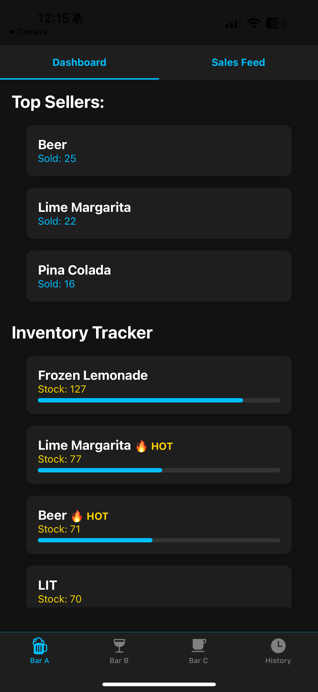
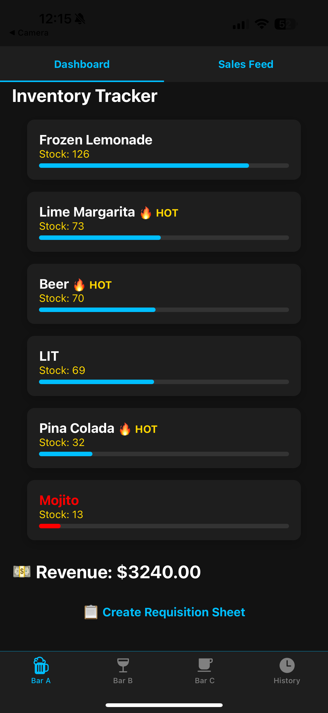
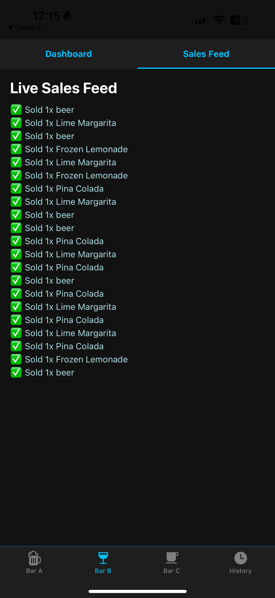
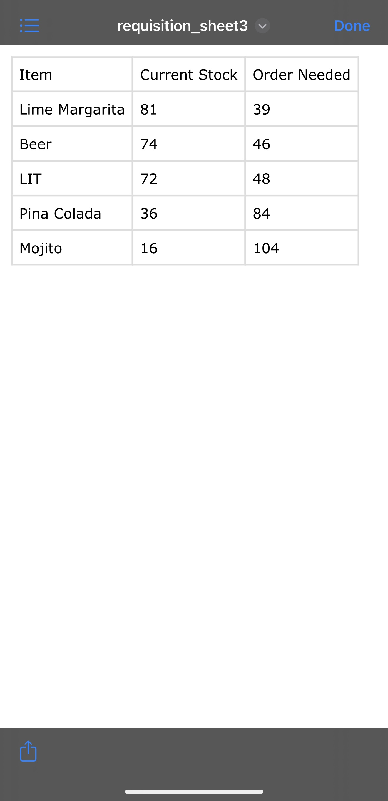

# Bar Manager Dashboard 🍹

A real-time bar inventory and sales tracking mobile app built with React Native (Expo) and Firebase. Designed for bar managers, staff, and operators to monitor top-selling drinks, track inventory levels across multiple bar locations, and export requisition sheets — all from their phone.

---

## 📱 Features

- **Multi-Location Support**: Bar A, B, C — each with its own sales feed and inventory.
- **Live Sales Simulation**: Every 3 seconds, sales are simulated for realistic tracking.
- **Top Sellers Roulette**: See which drinks are hot (🔥) or cold (❄️) in real-time.
- **Inventory Tracker**: Color-coded low stock alerts with progress bar indicators.
- **Requisition Sheet Generator**: Export CSV-style sheet with current inventory + what needs restocking.
- **Download History**: See a timeline of when requisition files were created.
- **Modern UI**: Built with dark mode, safe area views, and Material Top Tabs.

---

## 🛠 Tech Stack

- **React Native (Expo)**
- **Firebase Firestore** (per-bar collections)
- **React Navigation** (Bottom Tabs + Top Tabs)
- **Expo FileSystem + Sharing** (for generating and sharing requisitions)

---

## 🚀 Getting Started

```bash
git clone https://github.com/yourusername/bar-manager-dashboard.git
cd bar-manager-dashboard
npm install
npx expo start --tunnel
```

---
## 🎥 Demo Video

[](https://www.youtube.com/watch?v=EmQR9Gph54E)

## 📸 Screenshots

### 🔹 Dashboard View


### 🔹 Inventory Tracker


### 🔹 Live Sales Feed


### 🔹 Requisition Export


---

## 🔥 Author

**Kaan Nazlioz** — bartender turned full-stack mobile dev ✨

💬 DM me if you want to test the app in your bar or collaborate on future hospitality tech.

---

## 📦 License

MIT

